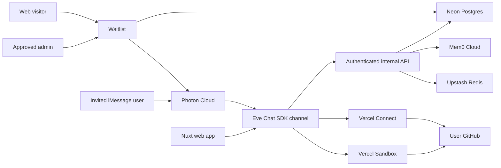

# Architecture

use-memory deploys a Nuxt application and an Eve agent as separate Vercel services from one repository.

## Identity boundary

The Better Auth user ID is canonical. The same value scopes:

- Eve session authentication
- the verified E.164 phone number
- Mem0 `user_id`
- Vercel Connect subjects
- profile, onboarding, and durable memory-job rows

The `user.phone_number` field is unique and usable only when `phone_number_verified` is true. There is no separately editable phone-link identity table.

## iMessage flow

1. A visitor submits a phone, platform, and messaging consent on the public waitlist.
2. An authenticated administrator listed in `WAITLIST_ADMIN_IDENTIFIERS` grants access.
3. For iPhone entries, the Nuxt service asks Eve to send a Photon invitation. The stored result means Photon accepted the request, not that the carrier delivered it.
4. The user replies `START`; Photon signs and posts the event to `/eve/v1/photon`.
5. The adapter validates the webhook signature and replay window.
6. Group conversations receive a privacy-safe DM-only refusal.
7. An invited unknown phone receives an OTP; only its hash, expiry, attempts, and resend timestamp are stored. An uninvited phone receives the waitlist URL instead.
8. After verification, onboarding resumes from its durable Postgres step.
9. The verified Better Auth user ID authenticates the Eve turn.
10. Eve sends the completed response through Photon.

Native single-choice polls are used when available. Numbered replies are the durable fallback because Photon does not provide arbitrary multiselect and serverless poll callback state can be lost.

## Authentication and browser handoff

Better Auth exposes `/api/auth/*` and supports:

- phone OTP as primary sign-in
- optional verified recovery email
- hashed, single-use recovery magic links through Resend
- hashed, five-minute iMessage browser links

The iMessage browser link creates a session only for an already verified phone user, then redirects to a fixed allowlisted path such as `/connect/github`. It cannot redirect to an arbitrary origin.

## Memory flow

Curated profile memory remains a pinned, editable source of user context. Automatic memory is separate:

1. At `turn.started`, Eve requests up to eight relevant Mem0 facts.
2. Returned facts are JSON-quoted and labeled untrusted data, not instructions.
3. After a completed turn, the final user/assistant pair is staged in Postgres by session and turn ID.
4. A retry worker claims the row, writes it to Mem0, and clears the Redis recall cache.
5. Credentials, OAuth tokens, OTPs, and other secret-shaped content are skipped.

Consent defaults off for web-created accounts. Conversational onboarding enables it only after the user explicitly agrees. Settings → Profile can pause recall, search/delete individual facts, or forget everything.

## External connections

GitHub uses Vercel Connect. The application never asks users for developer keys or personal access tokens. A Connect token is requested with the Better Auth user ID as its subject, so grants cannot cross users.

Selected connectors receive separate short-lived browser links during onboarding. When authorization returns to Settings, the server confirms the grant and sends an iMessage confirmation to the verified phone.

## Coding sandbox

Explicit coding requests may use an app-owned Vercel Sandbox. The agent requests a short-lived GitHub token limited to the named repository with `contents:read`, clones into a fresh one-vCPU microVM, removes credentials from the Git remote, runs a bounded command batch, returns logs and a diff, and stops the non-persistent VM in `finally`.

The user's Better Auth identity selects the GitHub grant, but Sandbox itself authenticates through the `use-memory` deployment's Vercel OIDC identity. Public Sign in with Vercel does not grant resource API access; those scopes remain private beta. Per-user Vercel Sandbox billing is therefore not represented as connected in v1.

Sandbox never receives a GitHub write token. After an explicit user request in iMessage, the GitHub tools may publish the reviewed diff by creating a branch, updating files, and opening a pull request. Merge and destructive operations remain approval-gated.

## Storage

| Store | Data |
| --- | --- |
| Neon Postgres | Waitlist consent/status, auth, verified phone, sessions, profile, curated memory, onboarding, Mem0 staging |
| Upstash Redis | Chat SDK state, deduplication, short recall cache |
| Mem0 Cloud | Per-user episodic and semantic facts |
| Vercel Connect | Per-user GitHub grants |
| Vercel Sandbox | Ephemeral app-owned repository execution |
| Resend | Recovery and email-verification delivery |

Local development uses PGlite and process-memory Chat SDK state when remote services are absent.

## Android boundary

Android submissions are collected with a recovery email but are not invited in v1. Photon remains the iMessage transport. A future Android lane should attach a Chat SDK SMS/RCS adapter and feed its verified phone identity into the same Better Auth user and onboarding state; it must not create a parallel user namespace.
